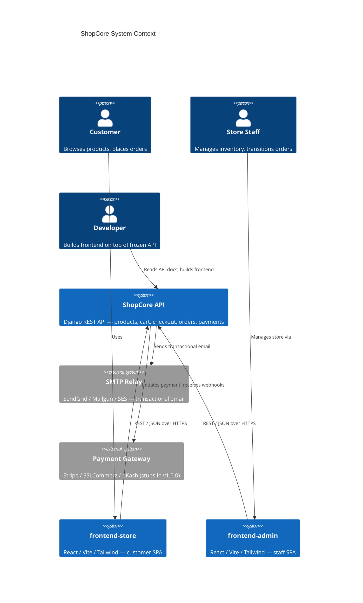
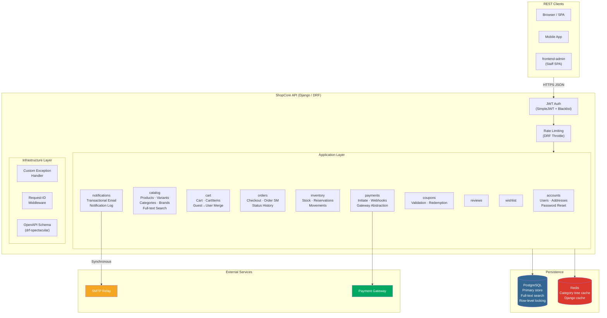
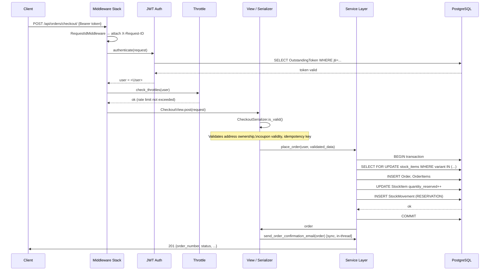
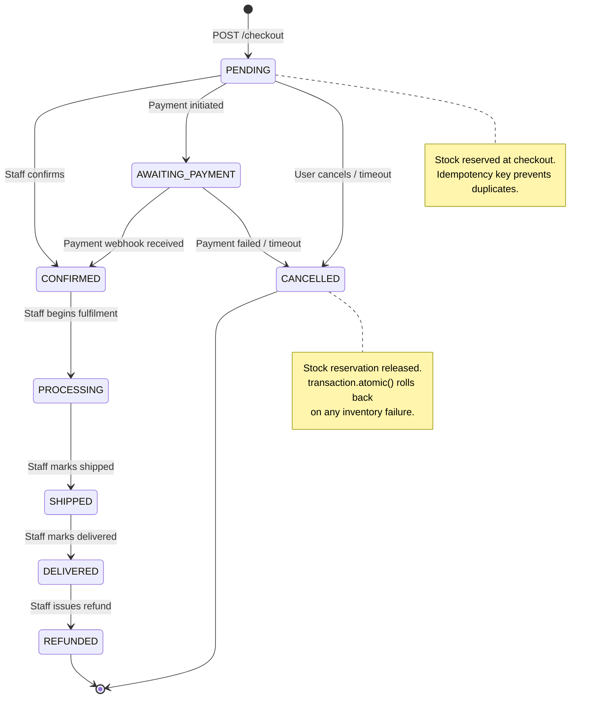
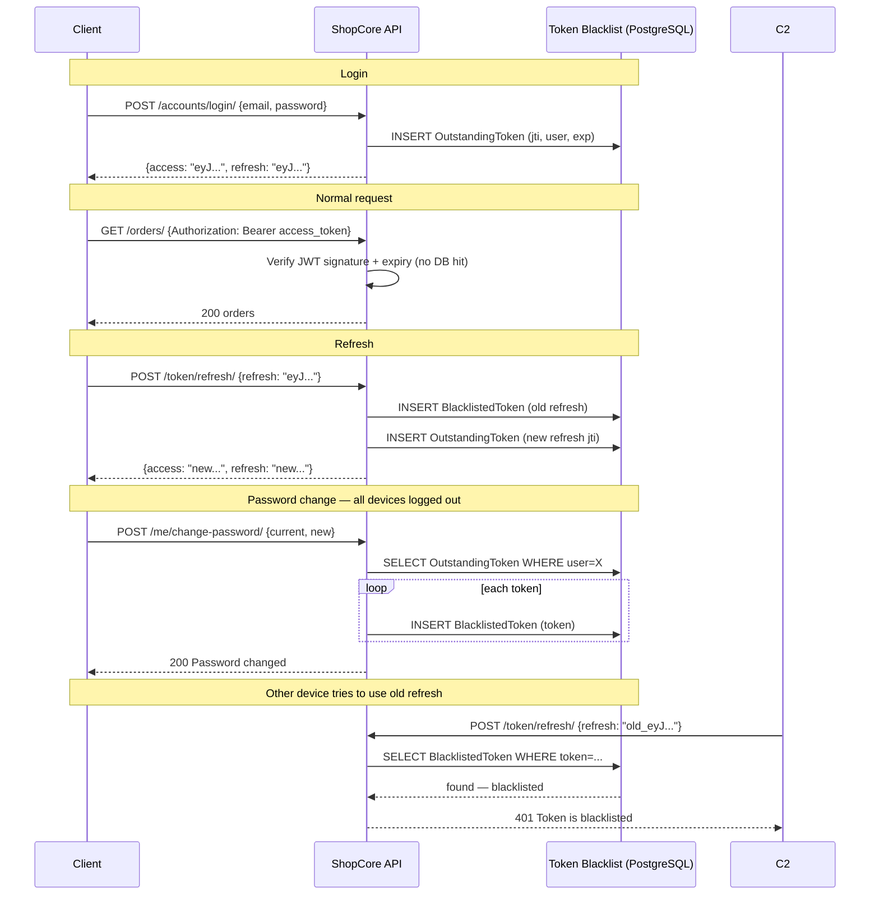
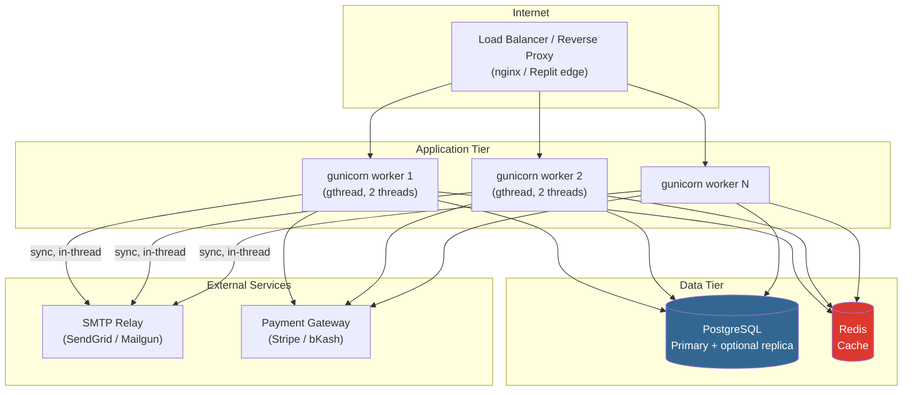

# ShopCore — Architecture Overview

## System Context

---

## Application Architecture

---

## Request Lifecycle

---

## Order Status Machine

---

## Inventory Reservation Flow

```mermaid
flowchart LR
    A["POST /checkout"] --> B["BEGIN transaction.atomic()"]
    B --> C["SELECT FOR UPDATE\nstockitem WHERE variant IN items"]
    C --> D{Enough stock?}
    D -- No --> E["ROLLBACK\n→ 400 INSUFFICIENT_STOCK"]
    D -- Yes --> F["INSERT Order + OrderItems"]
    F --> G["UPDATE stockitem\nqty_reserved += ordered_qty"]
    G --> H["INSERT StockMovement\n(RESERVATION)"]
    H --> I["COMMIT"]
    I --> J["Order status: PENDING"]

    J --> K{Payment received?}
    K -- Yes --> L["transition PENDING → CONFIRMED"]
    L --> M["BEGIN transaction.atomic()"]
    M --> N["SELECT FOR UPDATE stockitem"]
    N --> O["UPDATE stockitem\nqty_available -= ordered_qty\nqty_reserved -= ordered_qty"]
    O --> P["INSERT StockMovement\n(SALE)"]
    P --> Q["COMMIT — stock committed"]

    K -- No/Timeout --> R["transition → CANCELLED"]
    R --> S["BEGIN transaction.atomic()"]
    S --> T["UPDATE stockitem\nqty_reserved -= ordered_qty"]
    T --> U["COMMIT — stock released"]
```

---

## Authentication Flow (JWT with Device Logout)

---

## Deployment Topology (Production)

> **Known limitation:** Email is sent synchronously in the worker thread. Under
> load, SMTP latency can block all workers. The code is structured for easy Celery
> migration (all notification functions accept plain arguments). This is tracked as
> M-4 in `PRODUCTION_READINESS_AUDIT_4.md`.
