# ShopCore — Entity-Relationship Diagram

```mermaid
erDiagram
    %% ──────────────────────────────────────────────────────
    %% ACCOUNTS
    %% ──────────────────────────────────────────────────────
    User {
        bigint id PK
        string email UK
        string first_name
        string last_name
        string password
        bool is_active
        bool is_staff
        bool is_email_verified
        datetime date_joined
        datetime last_login
    }

    Address {
        bigint id PK
        bigint user_id FK
        string full_name
        string phone
        string address_line_1
        string address_line_2
        string city
        string state
        string postal_code
        string country
        bool is_default
        datetime created_at
        datetime updated_at
    }

    User ||--o{ Address : "has"

    %% ──────────────────────────────────────────────────────
    %% CATALOG
    %% ──────────────────────────────────────────────────────
    Category {
        bigint id PK
        bigint parent_id FK
        string name
        string slug UK
        string description
        string image
        int display_order
        bool is_active
        datetime deleted_at
    }

    Brand {
        bigint id PK
        string name
        string slug UK
        string logo
        string description
        bool is_active
        datetime deleted_at
    }

    Attribute {
        bigint id PK
        string name
        string slug UK
    }

    AttributeValue {
        bigint id PK
        bigint attribute_id FK
        string value
        int display_order
    }

    Product {
        bigint id PK
        bigint category_id FK
        bigint brand_id FK
        string name
        string slug UK
        string description
        string short_description
        string sku UK
        decimal base_price
        decimal compare_at_price
        string status
        bool is_featured
        decimal average_rating
        int review_count
        decimal weight_kg
        string meta_title
        string meta_description
        tsvector search_vector
        datetime created_at
        datetime updated_at
        datetime deleted_at
    }

    ProductImage {
        bigint id PK
        bigint product_id FK
        string image
        string thumbnail
        string alt_text
        int display_order
        bool is_primary
        datetime created_at
    }

    ProductVariant {
        bigint id PK
        bigint product_id FK
        string sku UK
        decimal price_override
        bool is_active
        datetime created_at
        datetime updated_at
    }

    Category ||--o{ Category : "parent"
    Category ||--o{ Product : "contains"
    Brand ||--o{ Product : "makes"
    Product ||--o{ ProductImage : "has"
    Product ||--o{ ProductVariant : "has"
    Attribute ||--o{ AttributeValue : "has"
    ProductVariant }o--o{ AttributeValue : "described by"

    %% ──────────────────────────────────────────────────────
    %% INVENTORY
    %% ──────────────────────────────────────────────────────
    Warehouse {
        bigint id PK
        string name
        string location
        bool is_active
    }

    StockItem {
        bigint id PK
        bigint variant_id FK
        bigint warehouse_id FK
        int quantity_available
        int quantity_reserved
        datetime created_at
        datetime updated_at
    }

    StockMovement {
        bigint id PK
        bigint stock_item_id FK
        bigint order_id FK
        string movement_type
        int quantity
        string note
        datetime created_at
    }

    ProductVariant ||--o{ StockItem : "tracked in"
    Warehouse ||--o{ StockItem : "holds"
    StockItem ||--o{ StockMovement : "records"

    %% ──────────────────────────────────────────────────────
    %% CART
    %% ──────────────────────────────────────────────────────
    Cart {
        bigint id PK
        bigint user_id FK
        string session_key
        bool is_active
        datetime created_at
        datetime updated_at
    }

    CartItem {
        bigint id PK
        bigint cart_id FK
        bigint variant_id FK
        int quantity
        decimal unit_price_snapshot
        datetime created_at
        datetime updated_at
    }

    User ||--o{ Cart : "owns"
    Cart ||--o{ CartItem : "contains"
    ProductVariant ||--o{ CartItem : "referenced by"

    %% ──────────────────────────────────────────────────────
    %% COUPONS
    %% ──────────────────────────────────────────────────────
    Coupon {
        bigint id PK
        string code UK
        string discount_type
        decimal discount_value
        decimal minimum_order_amount
        int max_redemptions
        int max_redemptions_per_user
        datetime valid_from
        datetime valid_until
        bool is_active
    }

    CouponRedemption {
        bigint id PK
        bigint coupon_id FK
        bigint user_id FK
        bigint order_id FK
        datetime redeemed_at
    }

    Coupon ||--o{ CouponRedemption : "redeemed via"
    User ||--o{ CouponRedemption : "makes"

    %% ──────────────────────────────────────────────────────
    %% ORDERS
    %% ──────────────────────────────────────────────────────
    Order {
        bigint id PK
        bigint user_id FK
        bigint shipping_address_id FK
        bigint billing_address_id FK
        bigint coupon_id FK
        string order_number UK
        string status
        string idempotency_key
        decimal subtotal
        decimal discount_amount
        decimal shipping_amount
        decimal tax_amount
        decimal total_amount
        string notes
        datetime placed_at
        datetime updated_at
    }

    OrderItem {
        bigint id PK
        bigint order_id FK
        bigint variant_id FK
        string variant_sku_snapshot
        string product_name_snapshot
        int quantity
        decimal unit_price_snapshot
        decimal total_price
    }

    OrderStatusHistory {
        bigint id PK
        bigint order_id FK
        bigint changed_by_id FK
        string from_status
        string to_status
        string note
        datetime changed_at
    }

    User ||--o{ Order : "places"
    Address ||--o{ Order : "ships to"
    Coupon ||--o{ Order : "applied to"
    Order ||--o{ OrderItem : "contains"
    ProductVariant ||--o{ OrderItem : "referenced by"
    Order ||--o{ OrderStatusHistory : "records"
    User ||--o{ OrderStatusHistory : "changed by"
    Order ||--o{ StockMovement : "triggers"

    %% ──────────────────────────────────────────────────────
    %% PAYMENTS
    %% ──────────────────────────────────────────────────────
    Payment {
        bigint id PK
        bigint order_id FK
        string provider
        string status
        string external_id
        decimal amount
        string currency
        jsonb raw_response
        datetime created_at
        datetime updated_at
    }

    Order ||--o{ Payment : "paid via"

    %% ──────────────────────────────────────────────────────
    %% NOTIFICATIONS
    %% ──────────────────────────────────────────────────────
    NotificationLog {
        bigint id PK
        bigint user_id FK
        string notification_type
        string recipient
        string subject
        string status
        string error_message
        datetime created_at
    }

    User ||--o{ NotificationLog : "receives"

    %% ──────────────────────────────────────────────────────
    %% REVIEWS
    %% ──────────────────────────────────────────────────────
    Review {
        bigint id PK
        bigint product_id FK
        bigint user_id FK
        int rating
        string title
        string body
        bool is_approved
        datetime created_at
        datetime updated_at
    }

    Product ||--o{ Review : "reviewed by"
    User ||--o{ Review : "writes"

    %% ──────────────────────────────────────────────────────
    %% WISHLIST
    %% ──────────────────────────────────────────────────────
    Wishlist {
        bigint id PK
        bigint user_id FK
        datetime created_at
    }

    WishlistItem {
        bigint id PK
        bigint wishlist_id FK
        bigint product_id FK
        datetime created_at
    }

    User ||--|| Wishlist : "has"
    Wishlist ||--o{ WishlistItem : "contains"
    Product ||--o{ WishlistItem : "saved in"
```

---

## Key Constraints

| Constraint | Table | Columns | Type |
|------------|-------|---------|------|
| Unique per user idempotency | `Order` | `(user, idempotency_key)` | Unique |
| One default address per user | — | enforced in service layer | — |
| One review per user+product | `Review` | `(user, product)` | Unique |
| One wishlist per user | `Wishlist` | `user` | OneToOne |
| One stock item per variant+warehouse | `StockItem` | `(variant, warehouse)` | Unique |
| Coupon code | `Coupon` | `code` | Unique |
| Order number | `Order` | `order_number` | Unique |

## Indexes

| Table | Index columns | Reason |
|-------|---------------|--------|
| `Order` | `(user, status)` | Order list filtered by user + status |
| `Order` | `order_number` | Order lookup by number |
| `Product` | `search_vector` | PostgreSQL full-text search (GIN) |
| `Product` | `slug` | Product detail lookup |
| `Category` | `slug` | Category detail lookup |
